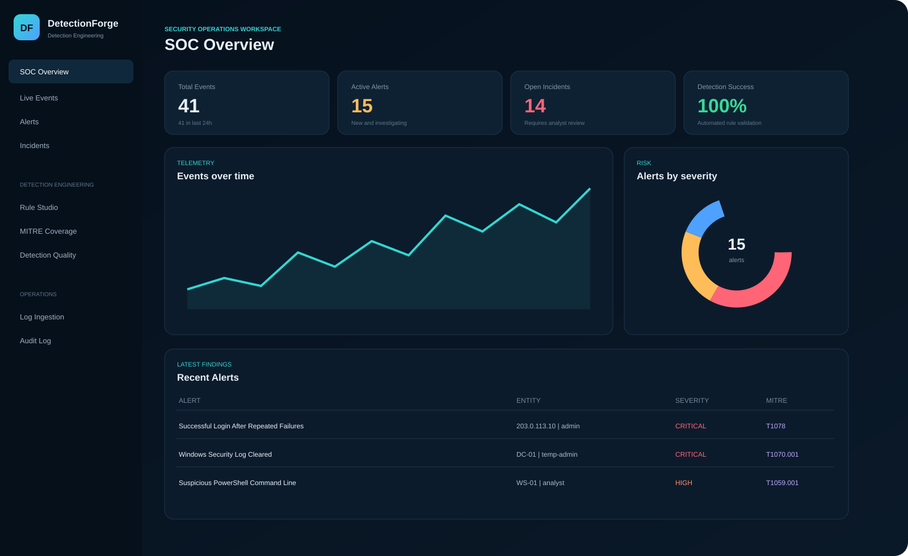
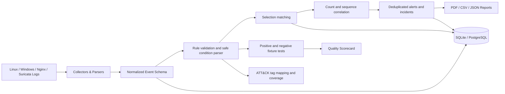

# DetectionForge

> **Detection engineering and Sigma-compatible rule testing platform for SOC teams.**

<p>
  
  
  
  
</p>

DetectionForge turns normalized security events into deterministic rule matches, count or sequence detections, deduplicated alerts, ATT&CK mappings, and fixture-based quality evidence. It implements a documented Sigma-compatible subset; it does not claim full Sigma compliance or production SIEM readiness.



## Why this matters

Detection rules are only useful when analysts can validate what they match, what they reject, and how correlation behaves at boundary conditions. DetectionForge makes that lifecycle visible and reproducible without executing rule content as code.

- 15 validated starter rules across Linux, Windows, network, and web telemetry.
- Positive and negative fixture execution with structured JSON output for CI.
- Safe boolean condition parsing with no `eval()`, `exec()`, or dynamic code execution.

## Highlights

- Multi-source log ingestion for Linux authentication logs, Windows/Sysmon JSON, Nginx access logs, Suricata EVE JSON, and normalized JSON.
- Common security event schema across all collectors.
- Sigma-compatible YAML subset with equality, lists, contains, prefix, suffix, existence, numeric, and bounded regular-expression operators.
- Count-based correlation and ordered sequence detection.
- Alert generation, risk scoring, incident correlation, timelines, notes, assignments, and case status management.
- MITRE ATT&CK technique and tactic mapping.
- Detection Quality scorecard with rule tests, pass rates, execution time, and version history.
- Rule Studio for editing, validating, enabling, disabling, and testing rules.
- Responsive dark SOC dashboard with charts, search, filters, and pagination.
- PDF, CSV, and JSON incident reports.
- Audit logging for ingestion, rule changes, notes, and case updates.
- REST API with automatically generated OpenAPI and Swagger documentation.
- Safe demo telemetry and 15 starter rules.
- SQLite for fast local use and PostgreSQL through Docker Compose.

## Detection Content

The included rule pack covers:

| Category | Examples |
|---|---|
| Linux | SSH brute force, successful login after failures, root login, local account creation |
| Windows | Suspicious PowerShell, cleared Security log, service installation, privileged group changes, account discovery, security control disable attempts |
| Network | High-confidence Suricata alerts, connection bursts, unusual DNS volume |
| Web | Directory traversal and injection-style web requests |

Every starter rule includes a safe test fixture and a MITRE ATT&CK mapping.

## Architecture



More detail is available in [`docs/ARCHITECTURE.md`](docs/ARCHITECTURE.md).
The normalized field contract and collision precedence are documented in [`docs/EVENT_SCHEMA.md`](docs/EVENT_SCHEMA.md).

## Quick Start on Kali Linux

```bash
unzip DetectionForge.zip
cd DetectionForge
chmod +x setup_kali.sh
./setup_kali.sh
source .venv/bin/activate
python run.py
```

Open:

```text
http://127.0.0.1:8000
```

API documentation:

```text
http://127.0.0.1:8000/docs
```

The installer:

1. Creates `.venv` inside the project.
2. Installs the minimal Python dependencies.
3. Creates `.env` with a random secret key.
4. Initializes the database.
5. Imports the YAML rules.
6. Loads safe demo telemetry and executes the detection pipeline.

## Manual Setup

```bash
python3 -m venv .venv
source .venv/bin/activate
python -m pip install --upgrade pip setuptools wheel
python -m pip install -r requirements.txt
cp .env.example .env
python scripts/init_db.py
python scripts/seed_demo.py
python run.py
```

## Docker Compose

```bash
cp .env.example .env
docker compose up --build
```

The Docker deployment uses PostgreSQL and exposes the platform on port `8000`.

> Replace the example database password and `SECRET_KEY` before any non-local deployment.

## Using the Platform

### Ingest Logs

Open **Log Ingestion**, choose a source type or Auto Detect, and upload a supported file. DetectionForge can immediately:

1. Normalize records.
2. Evaluate enabled rules.
3. Generate alerts.
4. Correlate alerts into incidents.

Sample files are available in [`sample-data/`](sample-data/).

### Add a Detection Rule

Rules use a documented [Sigma-compatible subset](docs/SIGMA_COMPATIBILITY.md):

```yaml
id: DF-LNX-001
title: Multiple Failed SSH Logins
logsource:
  category: linux_auth
level: high
mitre:
  technique: T1110
  name: Brute Force
  tactic: Credential Access
detection:
  selection:
    source: linux_auth
    event_type: failed_login
  condition: selection
  correlation:
    type: count
    group_by: [source_ip]
    threshold: 5
    timeframe: 5m
```

Put new rules in one of the directories under `rules/`, then click **Sync YAML Rules** or run:

```bash
python scripts/init_db.py
```

### Test a Rule

Rules can be tested from Rule Studio or the API:

```bash
curl -X POST http://127.0.0.1:8000/api/rules/1/test \
  -H 'Content-Type: application/json' \
  -d '{
    "name": "PowerShell validation",
    "expected": true,
    "event": {
      "source": "windows",
      "event_type": "process_create",
      "process_name": "powershell.exe",
      "command_line": "powershell -EncodedCommand AAA"
    }
  }'
```

## Project Structure

```text
DetectionForge/
├── app/
│   ├── routers/          # Web pages and REST endpoints
│   ├── services/         # Normalization, detection, correlation, reports
│   ├── static/           # Responsive dashboard CSS and JavaScript
│   ├── templates/        # SOC interface templates
│   ├── config.py
│   ├── database.py
│   ├── main.py
│   └── models.py
├── rules/                # Detection-as-code YAML rule pack
├── sample-data/          # Safe demonstration telemetry
├── scripts/              # Database and demo utilities
├── tests/                # Unit and integration tests
├── docs/                 # Architecture, security, and validation notes
├── Dockerfile
├── docker-compose.yml
├── setup_kali.sh
└── run.py
```

## Testing

```bash
source .venv/bin/activate
pytest -q
python scripts/test_rules.py --json reports/rule-tests.json
```

The automated suite and fixture runner cover:

- Linux, Nginx, and Suricata normalization.
- Detection matching and regex operators.
- Safe boolean parsing, malicious conditions, and malformed rule rejection.
- Count thresholds, timeframe boundaries, entity grouping, ordered sequences, and replay deduplication.
- Demo ingestion and detection execution.
- Dashboard, Events, Alerts, Incidents, Rules, Coverage, Quality, and Audit pages.
- API health and statistics endpoints.
- Rule testing through the API.
- PDF, CSV, and JSON report generation.

See [`docs/VALIDATION.md`](docs/VALIDATION.md) for the verified release results.

Fixture pass rates are test coverage, not real-world detection accuracy. See [Detection quality](docs/DETECTION_QUALITY.md).

## Security Notes

- Demo data uses documentation-only IP ranges and contains no malware.
- Uploaded files are size-limited and deleted after ingestion.
- `.env`, databases, reports, uploads, and virtual environments are excluded from Git.
- The project is a defensive educational platform, not a replacement for a production SIEM.
- Add authentication, TLS, centralized secrets, rate limiting, background jobs, and hardened storage before exposing it to untrusted networks.

See [`docs/SECURITY.md`](docs/SECURITY.md).

## Roadmap

- Broader Sigma aggregation, wildcard, and pipeline compatibility.
- Streaming collectors and WebSocket event updates.
- Authentication and role-based access control.
- Redis-backed task queue for large ingestion jobs.
- Elasticsearch/OpenSearch storage adapter.
- Detection rule Git synchronization and approval workflow.
- STIX/TAXII threat-intelligence enrichment.
- Case comments, attachments, and analyst collaboration.

## License

Released under the [MIT License](LICENSE).
